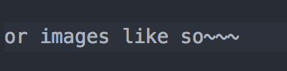

# Janice-Intro-to-Python-and-CS

## Markdown and this document
So this file is called a `markdown` file. It basically lets you do **crazy** text editing things without needing an interface like `Microsoft Word` to bold things,

```
put code snippets with special boxes,
```

(this is a screenshot^)

It just makes things easier to read, so it's good for documentation.

## Bash, definitions, and commands
### Bash
`Bash` is another language, just like `python`. It's the language your `terminal` understands, so to speak. It lets you run commands! You can code in it as well but we won't get into that for quite a while, if at all.

### Definitions
- **File** - This is just a file. A `.docx` is a file, a `.txt` is a file, you know what these are.
- **Directory** - This is essentially a folder. Your "home directory" is your username. In your `finder`, it's the house icon, cause home. This is mine:

Fun fact: Your "desktop" is a directory, or a folder. There's just a fancy interface (your entire screen lol) for users to interact with, but you totally don't need it once you have `terminal` down ;)

- **Path** - A path is a list of directories leading to a directory, or file. So say you have something on your desktop, `test.txt`. The **path** is something like: `~/Desktop/test.txt`. It tells the computer from the "base directory", so to speak, how to navigate to your file.

This might help:


- **~** - This is a `tilde`. It's what `bash` understands to be the full path up to your "home directory." The full path to the home directory is `/Users/JonathanPoch` or in your case, `/Users/lanicejee`. `~` is short for that full path.
`~` = `/Users/lanicejee`.

### Commands
- `ls` - This means "list". It lists everything in the directory you're in. This includes files and other directories.

- `pwd` - This means "**p**rint **w**orking **d**irectory." It lists the full **path** of where you currently are, where you're currently "working."

- `cd [SOME_DIRECORY]` - This means **c**hange **d**irectory. Call something like `cd ~/Desktop` to change your **directory** to the desktop. Remember, spaces are expressed as: `cd directory\ with\ space` or `cd "directory with space"`. `.` refers to your current directory, and `..` refers to the directory "one level up."
  - Your `pwd`, where you currently are, is `/Users/lanicejee/Desktop` or `~/Desktop`.
    - `.` refers to `/Users/lanicejee/Desktop` or `~/Desktop`.
    - `..` refers to `/Users/lanicejee` or `~`.

- `mkdir` - This means **m**a**k**e **dir**ectory. It creates a folder. Simple.

- `touch` - This creates a blank file of whatever type you want. `touch test.txt` creates a `test.txt` file in whatever directory you're in. You can specify whatever type you want, like `test.py` for a python file.

- `python` - This opens a python command line. You can run python code from it. Type `quit()` to exit back into your normal `bash` terminal.

- `python SOME_FILE.py` - You're telling python hi, go run this python file.

## GitHub, definitions, and commands
### GitHub
`GitHub` exists for something called ***version control***. It allows multiple people to work on a project and it keeps a master copy so everyone is on the same page and it doesn't get messy keeping your projects up to date. A project needs a working copy, and say it's something people use every day. You need to be able to keep working on a project (e.g. a website, a tool, etc.) while having something that works. Version control lets you have that stable, working copy while letting people work and make potentially product-breaking changes without bringing down a website or tool for everyone that uses it.

### Definitions
These are some basic terms you should get familiar with. We'll add to this~

- **Repository** - A repository is a container that holds all your code on `GitHub`. It's like a master copy that holds all changes you want, and a master copy everyone can use when they want the same files you have. It eliminates the overhead of say, copying and emailing files back and forth.

### Commands
These are commands for interacting with `GitHub` through your `Terminal`.

- `git pull` - Run this to pull down changes from the repository online, the "master copy." This is how you get changes I push up, and this is how I get changes you push up.
- `git status` - This command compares your repository on your computer to the repository online. It tells you what files you added, renamed, removed, moved, etc. This is more for a sanity check to make sure you didn't change something you didn't intend to.
- `git add [SOME_PATH]` - This command adds whatever you want to a "staging area" where you pick and choose what changes you want to push up to the "master copy" or online repository. Run `git add .` from your repository root (`~/Janice-Intro-to-Python-and-CS`). The `.` means the current folder, and it adds everything in the current folder, including other folders and so on.
- `git commit -m "YOUR_MESSAGE_HERE"` - This command takes whatever you `git add` and packages it, essentially, to `push` up to the online repository.
- `git push` - After you `git add` and `git commit`, this takes that "package" and uploads it to the repository.

**Important:** You should always run these in the order listed. Take changes made by others(`git pull`), see your changes (`git status`), pick what you want to send up to the repository (`git add`), package it with a message (`git commit -m`), and then send up to the repository (`git push`).

## Some neat tricks
#### Opening atom with whatever directory you want
In your `terminal`, run `atom ~/Janice-Intro-to-Python-and-CS`. `atom` is a command that tells your computer "hey, open `atom` please." It's the alternative to clicking on the icon on your mac's dock. `~/Janice-Intro-to-Python-and-CS` is the **argument** (remember functions? It works the same way) you pass in saying "hey, open `atom` with this directory loaded in."

#### Seeing the same markdown preview in `atom`
So see how the text is really nicely formatted in the repo (https://github.com/JonathanLPoch/Janice-Intro-to-Python-and-CS)? That's compiled `markdown` code. In `atom`, press all three: Control-Shift-M and you'll get the same preview!

#### Tab completion
When in your `terminal`, hit the `tab` key once to complete your file command, file name, or directory, or hit it twice if you have an ambiguous name. It makes a guess based on what you're possibly typing (say if you use `cd`, it'll guess based off character matching of all the directories you can list).
- Type out `cd ~/Janice` and hit `tab` to complete the full name.
- But type `cd ~/D` and hit `tab` to complete. It won't, right? But hit it **twice** and you'll see all the possibilities:

